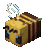
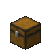

<h1>Hi there  </h1>
I prefer developing applications with React using Typescript.

<h1>Important repositories </h1>

- [🎯 aimtrain](https://github.com/Shiroyam/aimtrain.ru) / [aimtrain.ru](http://aimtrain.ru/) — Website with a minimalist design for aim testing.

<h1>Technologies & Tools  </h1>

         

      

  

     

  

<!--
**Shiroyam/Shiroyam** is a ✨ _special_ ✨ repository because its `README.md` (this file) appears on your GitHub profile.

Here are some ideas to get you started:

- 🔭 I’m currently working on ...
- 🌱 I’m currently learning ...
- 👯 I’m looking to collaborate on ...
- 🤔 I’m looking for help with ...
- 💬 Ask me about ...
- 📫 How to reach me: ...
- 😄 Pronouns: ...
- ⚡ Fun fact: ...
-->
